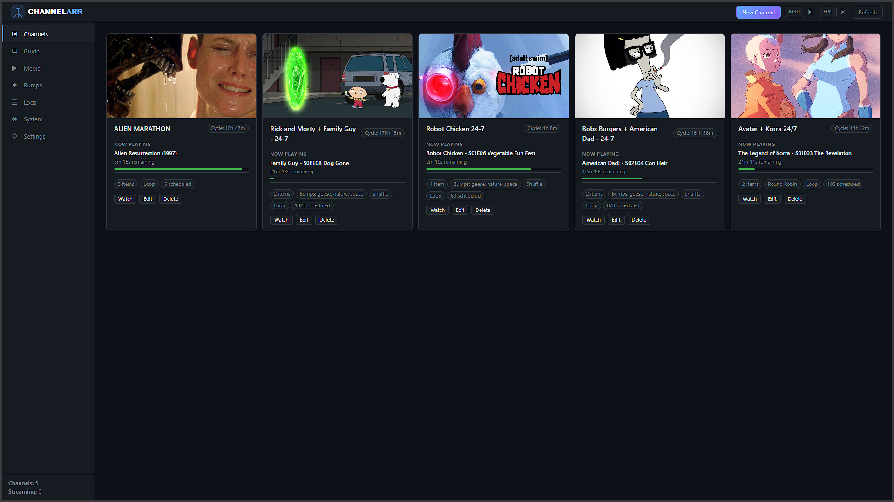
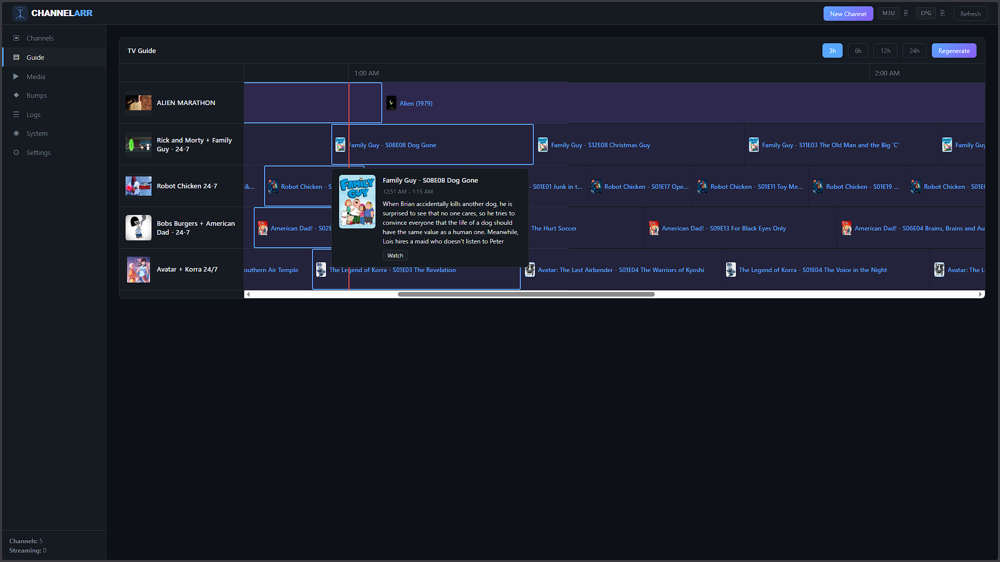
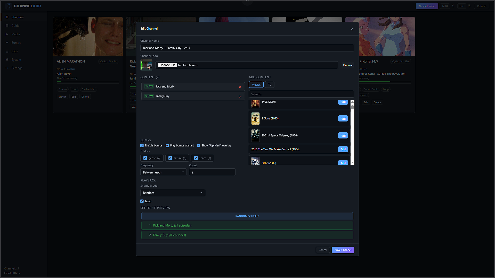
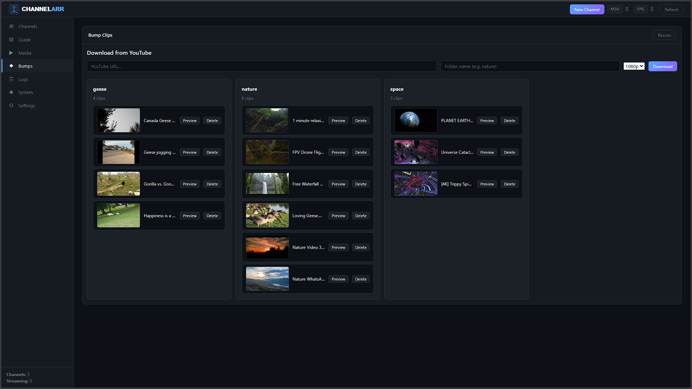
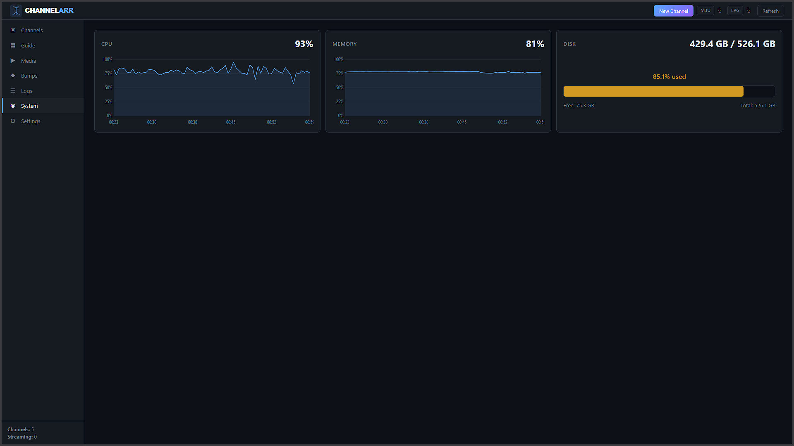

# Channelarr

A self-hosted custom TV channel builder. Create your own 24/7 live TV channels from your media library and YouTube — movies, TV shows, YouTube channels/playlists, and bump clips — served as HLS streams compatible with Jellyfin, Threadfin, Manifold, or any IPTV client.

YouTube videos are streamed ephemerally — downloaded just before playback, encoded through the same pipeline as local files, and deleted immediately after. Zero permanent storage.

## What It Does

Channelarr lets you build TV channels that feel like real broadcast television. Add movies, shows, and YouTube content to a channel, configure bumps (short interstitial clips like station idents or "up next" segments), and the app generates a persistent EPG schedule with real timestamps. When a client requests a stream, encoding starts from wherever the schedule says it should be — even mid-episode — just like tuning into a real TV channel.

Channels are always on standby. No background processes, no always-on streams — everything is client-driven. Streams spin up on demand when a viewer tunes in and auto-stop after 5 minutes with no viewers. YouTube videos are downloaded just-in-time (2 videos ahead of the current position), streamed through the same FFmpeg pipeline as local files, and deleted immediately after playback. At any moment, only 2-3 YouTube videos exist on disk.

## Screenshots


*Channel cards with now-playing info and progress bars*


*EPG grid with color-coded programme blocks and red "now" line*


*Channel builder with media picker, shuffle modes, and bump configuration*


*Bump clip library with folder organization and YouTube downloads*


*CPU, RAM, and disk monitoring with 24-hour history charts*

## Features

- **Ephemeral YouTube Streaming** — Add YouTube channels and playlists as content sources. Videos are downloaded just before playback and deleted immediately after — zero permanent storage. Browse and add entire playlists from the channel editor. Thumbnails appear in the EPG guide and XMLTV export.
- **Persistent EPG Schedule** — Each channel gets a materialized schedule with real start/stop timestamps for every programme. The schedule loops continuously and drives the TV guide, XMLTV export, and stream positioning. YouTube and local content are interleaved seamlessly.
- **Fully On-Demand** — No background processes, no always-on daemons. Streams start when a client tunes in and stop when viewers leave. YouTube downloads happen just-in-time during active streams only.
- **Schedule-Aware Streaming** — When a client tunes in, FFmpeg seeks to the correct position in the schedule. If the guide says a movie is 45 minutes in, that's where playback begins.
- **TV Guide** — EPG grid with channel logos, color-coded programme blocks, click-to-view detail popovers with poster art (or YouTube thumbnails) and plot descriptions, and a red "now" line.
- **Channel Builder** — Create channels from your movie/TV library and YouTube. Add whole shows, individual episodes, or entire YouTube playlists. Configure shuffle mode, loop, and bumps per-channel.
- **Advanced Shuffle Modes** — Four shuffle strategies: **None** (play in order), **Random** (full shuffle), **Round Robin** (alternate episodes across shows: A1, B1, A2, B2...), and **Weighted Random** (percentage-based split, e.g. 75% Show A / 25% Show B). Configurable from the UI or API.
- **Bump System** — Insert short clips between content (station idents, transitions, promos). Organize bumps into folders, download from YouTube via yt-dlp, and configure frequency, count, and placement per channel.
- **"Up Next" Overlays** — During bumps, display the next content's title and poster image with a countdown timer, just like real TV.
- **HLS Streaming** — Pipe-based FFmpeg architecture for seamless, gapless playback. No stuttering at file boundaries. Outputs standard HLS (`.m3u8` + `.ts` segments).
- **On-Demand Lifecycle** — Streams start automatically when a client requests the playlist and stop after 5 minutes with no viewers.
- **M3U + XMLTV Export** — One-click copy of M3U playlist and XMLTV EPG URLs from the header bar. Seamless programme data with no gaps (bump durations absorbed into adjacent programmes).
- **NFO Metadata** — Episode plots, movie descriptions, and poster art are read from sidecar NFO files and displayed in the guide and EPG export.
- **Channel Logos** — Upload PNG/JPEG logos per channel. Included in M3U, EPG, and the guide sidebar.
- **Media Browser** — Scan your filesystem for movies and TV shows. Poster art detected automatically from sidecar files.
- **Web UI** — Dark-themed single-page app with channel cards (now-playing + progress), TV guide, media picker, bump manager, live log tail, system stats (CPU/RAM/disk charts), and settings editor.
- **Configurable Encoding** — x264 preset, CRF, thread count, audio bitrate — all tunable from the settings page.

## Security

Channelarr has no built-in authentication. It is designed for trusted private networks. If you need to expose it beyond your LAN, run it behind a reverse proxy (Traefik, Caddy, nginx) with authentication.

## Quick Start

### Docker Compose

```yaml
services:
  channelarr:
    build: .
    ports:
      - "5045:5045"
    volumes:
      - /path/to/media:/media:ro
      - /path/to/bumps:/bumps
      - /path/to/m3u:/m3u
      - channelarr-data:/app/data
      - channelarr-logs:/app/logs
    environment:
      - BASE_URL=http://your-server-ip:5045

volumes:
  channelarr-data:
  channelarr-logs:
```

```bash
docker compose up -d
```

Open `http://your-server-ip:5045` in your browser.

## Usage

### 1. Create a Channel

Click **New Channel**, give it a name, and add content from your media library or YouTube. Optionally upload a logo and configure bumps. The schedule is automatically generated when you save.

### 2. Configure Bumps (Optional)

Place short video clips in folders under your bumps path. In the channel editor, enable bumps, select folders, and set frequency (between every item, or every N items). Enable "Show Next" to overlay upcoming content info during bumps.

### 3. Configure Shuffle Mode (Optional)

In the channel editor under **Playback**, choose a shuffle mode:

- **None** — Content plays in the order listed
- **Random** — All episodes/movies are fully randomized
- **Round Robin** — Episodes alternate across shows. With 2 shows, it's every-other (A1, B1, A2, B2...). Scales to any number of shows.
- **Weighted Random** — Set a percentage per show (must total 100%). Episodes are distributed proportionally then randomized. E.g., 75% Show A / 25% Show B.

For AI agent integration, `GET /api/channels/shuffle-modes` returns the full schema and example payloads for creating channels with any shuffle mode via the API.

### 4. Add YouTube Content (Optional)

In the channel editor, click the **YouTube** tab in the content picker. Paste a YouTube channel or playlist URL and click **Browse**. Videos appear with thumbnails and durations. Click **Add** on individual videos or **Add All** to add the entire playlist.

YouTube videos are not downloaded when you save the channel — only their metadata (title, duration, thumbnail) is stored. Downloads happen automatically when the stream reaches each video:

1. The next 2 YouTube videos are pre-fetched in the background
2. When the schedule reaches a YouTube entry, the file is already waiting
3. FFmpeg encodes it through the same pipeline as local files
4. After playback, the file is deleted immediately

If a download fails (network issue, removed video), the entry is skipped and the stream continues with the next item.

### 5. Watch

Click **Watch** on any channel card. For channels with YouTube content, the first playback may take 30-60 seconds while the initial video downloads.

For channels with YouTube content, the first playback may take 30-60 seconds while the initial video downloads. The stream URL for external clients is:

```
http://your-server-ip:5045/live/<channel-id>/stream.m3u8
```

### 6. Add to IPTV Clients

Copy the M3U and EPG URLs from the header bar (click the clipboard icon). Add them to Jellyfin, Threadfin, Manifold, or any IPTV client that supports M3U + XMLTV.

- **M3U**: `http://your-server-ip:5045/api/export/m3u`
- **EPG**: `http://your-server-ip:5045/api/export/xmltv`

#### Plex (HDHomeRun)

Channelarr emulates an HDHomeRun tuner, so Plex can discover it as a live TV source. In Plex, go to **Settings > Live TV & DVR**, click **Set Up Plex DVR**, and enter `http://your-server-ip:5045` when prompted for the device address. Plex will detect the tuner and import your channel lineup automatically.

HDHomeRun endpoints:

- `/discover.json` — Device discovery
- `/lineup.json` — Channel lineup
- `/lineup_status.json` — Scan status
- `/device.xml` — UPnP device descriptor

### 7. Guide & Schedule Management

- **Guide** sidebar view shows the full TV guide grid across all channels
- **Refresh** (header) regenerates M3U + XMLTV from existing schedules
- **Regenerate** (guide page) rebuilds all channel schedules from scratch

## Configuration

All settings are configurable from the web UI under **Settings**:

| Setting | Default | Description |
|---------|---------|-------------|
| MEDIA_PATH | `/media` | Root path to your media library |
| BUMPS_PATH | `/bumps` | Root path to bump clip folders |
| HLS_OUTPUT_PATH | `/app/data/hls` | Where HLS segments are written |
| M3U_OUTPUT_PATH | `/m3u` | Where M3U and XMLTV files are written |
| HLS_TIME | `6` | HLS segment duration in seconds |
| HLS_LIST_SIZE | `10` | Number of segments in the playlist window |
| VIDEO_PRESET | `fast` | x264 encoding preset |
| VIDEO_CRF | codec default | Constant Rate Factor (quality) |
| FFMPEG_THREADS | `1` | FFmpeg threads |
| X264_THREADS | `4` | x264 encoder threads |
| AUDIO_BITRATE | `192k` | AAC audio bitrate |
| BASE_URL | `http://localhost:5045` | Public base URL for M3U/EPG links |

## API

All endpoints are under `/api`:

| Method | Endpoint | Description |
|--------|----------|-------------|
| GET | `/health` | Health check |
| GET | `/api/status` | Channel count and streaming count |
| GET | `/api/channels` | List all channels with now-playing info |
| POST | `/api/channels` | Create channel (auto-materializes schedule) |
| GET | `/api/channels/<id>` | Get channel with schedule and now-playing |
| PUT | `/api/channels/<id>` | Update channel (re-materializes schedule) |
| DELETE | `/api/channels/<id>` | Delete channel |
| GET | `/api/channels/shuffle-modes` | Shuffle mode schemas and example payloads (for AI agents) |
| GET | `/api/logo/<id>` | Get channel logo |
| POST | `/api/logo/<id>` | Upload channel logo |
| DELETE | `/api/logo/<id>` | Delete channel logo |
| GET | `/api/epg/now` | Current programme on all channels |
| GET | `/api/epg/guide?hours=6` | TV guide data for next N hours |
| POST | `/api/schedule/refresh` | Regenerate M3U + XMLTV (soft) |
| POST | `/api/schedule/regenerate` | Rebuild all schedules + M3U + XMLTV (hard) |
| GET | `/api/export/m3u` | Download M3U playlist file |
| GET | `/api/export/xmltv` | Download XMLTV EPG file |
| GET | `/api/media/movies` | List movies |
| GET | `/api/media/tv` | List TV shows |
| GET | `/api/media/tv/episodes?path=...` | List episodes for a show |
| GET | `/api/media/poster?path=...` | Get poster image for a media item |
| GET | `/api/bumps` | List all bump folders and clips |
| POST | `/api/bumps/scan` | Rescan bumps directory |
| DELETE | `/api/bumps/clip` | Delete a bump clip |
| POST | `/api/bumps/download` | Download a video as a bump clip |
| GET | `/api/bumps/thumbnail?path=...` | Get thumbnail for a bump clip |
| GET | `/api/settings` | Get settings schema and values |
| POST | `/api/settings` | Save settings |
| GET | `/api/system/stats` | CPU, RAM, disk stats + 24h history |
| GET | `/api/logs/tail?pos=0` | Tail application log file |
| POST | `/api/youtube/browse` | Browse a YouTube channel or playlist |
| GET | `/discover.json` | HDHomeRun device discovery |
| GET | `/lineup.json` | HDHomeRun channel lineup |
| GET | `/lineup_status.json` | HDHomeRun scan status |
| GET | `/device.xml` | UPnP device descriptor |

## Architecture

```
channelarr/
  core/
    channels.py    — Channel CRUD, schedule materialization, position calculation
    streamer.py    — FFmpeg HLS streaming engine (pipe-based, schedule-aware)
    youtube.py     — YouTube metadata, ephemeral download, cache management
    bumps.py       — Bump clip scanning, cycling, YouTube downloads
    media.py       — Media library filesystem scanner
    config.py      — JSON-backed settings with env fallback
    nfo.py         — NFO metadata parsing (titles, plots), poster discovery
    xmltv.py       — XMLTV EPG generation from materialized schedules
  web/
    app.py         — FastAPI application with lifespan (startup/shutdown)
    shared_state.py — Module-level managers, stats collector, M3U regen
    routers/
      channels.py  — Channel CRUD + logo endpoints
      epg.py       — EPG, schedule, and M3U/XMLTV export
      media.py     — Media library endpoints
      bumps.py     — Bump clip management
      youtube.py   — YouTube browse endpoint
      settings.py  — Settings endpoints
      system.py    — System stats + log tail
      hls.py       — HLS playlist/segment serving + schedule-aware auto-start
    static/        — CSS, JS
    templates/     — HTML
```

### Schedule System

Each channel's schedule is **materialized** — expanded into a flat list of entries with real timestamps, durations, and metadata (from NFO files). The schedule is persisted in `channels.json` and serves as the single source of truth for:

- **Stream positioning**: FFmpeg seeks to the correct point when a client tunes in
- **TV guide**: The guide grid is rendered directly from the schedule
- **XMLTV export**: Programme data with real start/stop times, titles, and descriptions
- **Now-playing**: Channel cards show what's currently on with a progress bar

Bump clips are included in the schedule for timing accuracy but excluded from EPG/guide output. Each programme's stop time extends to the next programme's start, absorbing bump durations for seamless guide display.

### Streaming Pipeline

Content files are encoded by FFmpeg to MPEG-TS and piped into an HLS segmenter. The pipe never breaks between files, so playback is seamless. The first file in a session may be seeked into (via `-ss`) to match the schedule position. Streams auto-stop after 5 minutes of inactivity.

### YouTube Integration

YouTube videos are treated as ephemeral content — no permanent storage. When the stream reaches a YouTube entry, the pre-fetch worker has already downloaded it to a temporary cache (`/app/data/yt_cache/`). After FFmpeg finishes encoding the file, it is deleted immediately. The pre-fetch worker stays 2 entries ahead of the current position, so downloads happen in the background while the current item plays. If a download fails, the entry is skipped and the stream continues. The cache is wiped on every startup.

## Stack

- **FastAPI** + **Uvicorn** (ASGI)
- **Jinja2** templates + vanilla CSS + vanilla JS
- **FFmpeg** for encoding (included in Docker image)
- **yt-dlp** for YouTube metadata and downloads (included in Docker image)
- JSON file storage (no database)

## Requirements

- Docker
- A media library (movies/TV shows as video files) and/or YouTube URLs

## License

MIT
